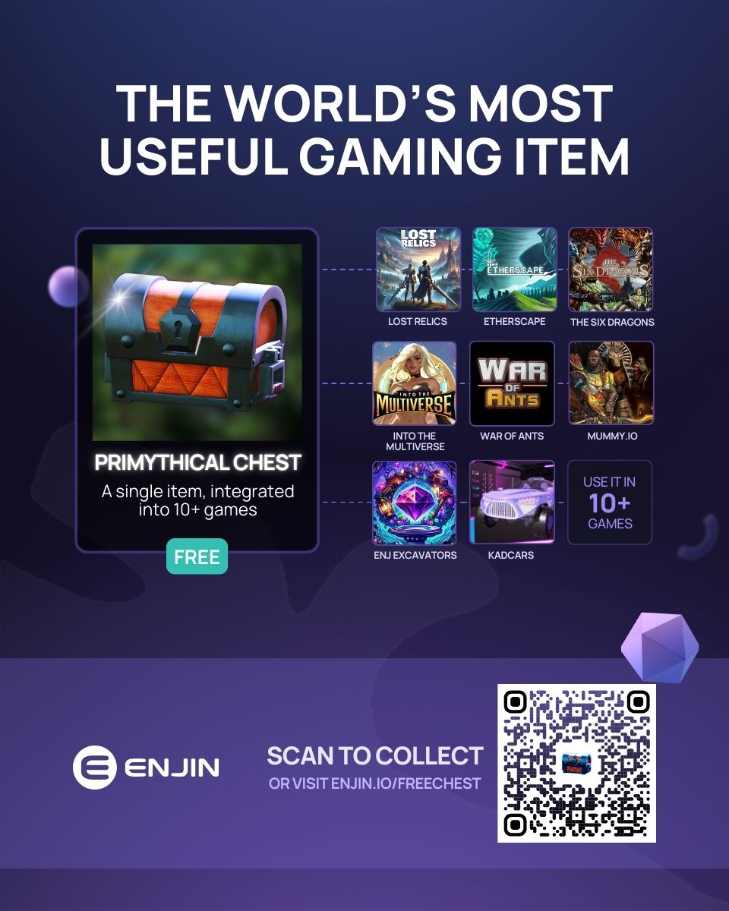

import GlossaryTerm from '@site/src/components/GlossaryTerm';

<GlossaryTerm id="the_multiverse" /> is the world's first cross-game item economy, that offers you a powerful growth engine to attract new players into your game and keep them coming back every month.

When you join, you will be promoted on the [Multiverse Codex](https://enjin.io/multiverse), which acts as an inbound funnel that showcases your game and gives players more reasons to try it.

These players can then participate in <GlossaryTerm id="multiverse_quests" />, a monthly event where you can reward them with <GlossaryTerm id="multiverse_items" /> when they play your game.

In return, you’re asked to add <GlossaryTerm id="utility" /> to the Multiverse Items you distribute, this makes them more desirable to players as they endlessly grow in power.

This creates an self-sustaining cycle that powers your game's growth:

1. **Ecosystem-Wide Promotion Fuels Player Attraction**: Multiverse Quests are promoted across the entire ecosystem, drawing in players who are interested in earning valuable cross-game items. This shared onboarding funnel not only boosts individual games but strengthens the whole ecosystem.

2. **Monthly Rewards Fuel Player Retention**: By offering new rewards each month, players have a continuous reason to return, keeping the community lively and excited.

3. **Growing Playerbase Attracts More Developers:** As the player community expands, more developers are drawn to the ecosystem, eager to tap into this engaged audience. They adopt the Multiverse items, which in turn gives new and existing players even more reasons to continue playing the existing games to earn these ever-evolving items.

4. **Utility of Multiverse Items Expands**: As more developers participate, the utility of Multiverse items increases across a wider range of games, making them even more appealing to players and attracting new players into the ecosystem.

This cycle—driven by consistent player engagement, developer involvement, and expanding item utility—creates a powerful loop that forms a self-reinforcing growth engine.

## Using the Primythical Chest to Acquire Players

The <GlossaryTerm id="primythical_chest" /> is an infinite supply promotional tool and Enjin's primary funnel for onboarding new players into your game. 

Enjin is giving away this item for free, then educating players on where they can use it.

Players can receive the item by scanning an <GlossaryTerm id="enjin_beam" /> QR code to get it for free.

Once they receive the item, they are directed to the [Multiverse Codex](https://enjin.io/multiverse), where they can find games to play where their new item has utility. This is how your game will get discovered.

Players will also start to discover a handful of other <GlossaryTerm id="multiverse_items" />that they can earn by playing yours and other games.

This will lead them to participate in <GlossaryTerm id="multiverse_quests" />, where they will play your game every month to earn more Multiverse Items.

### How to Add Your Game

To add your game to the [Multiverse Codex](https://enjin.io/multiverse), follow these steps:

1. Join the [Enjin Spark Program](https://enjin.io/join).
2. Adopt at least five Multiverse Items, including the Primythical Chest.

In return, your game will be promoted on the [Multiverse Codex](https://enjin.io/multiverse). While Enjin will help drive players to your game, it's your responsibility to convert their interest into lasting engagement.

Your placement on each item's codex will depend on the quality of your utility and the video content you provide.

## Using Multiverse Quests to Retain Players

Multiverse Items are designed as powerful tokens with <GlossaryTerm id="utility" /> across multiple games. Both new and existing players are always eager to collect these items, especially as they see their utility expand with adoption by more games.

Each month, Enjin will supply you with Multiverse Items to attract players eager to earn them in your game.

Monthly events will feature new opportunities for players to win different Multiverse Items in your game, creating ongoing engagement between you and the Enjin playerbase. 

Over time, players may aim to collect all available items or trade them on [NFT.io](https://nft.io).

To enter the quest, players will need to follow these steps:

**1. Download the [Enjin Wallet](https://enjin.io/technology/wallet)**

- Receive, secure, and manage your cross-game inventory. Available on [Android](https://play.google.com/store/apps/details?id=com.enjin.mobile.wallet&referrer=utm_source%3Dorganic_software_wallet%26utm_medium%3DOrganic%26utm_term%3Dsoftware_wallet_LP%26utm_content%3DDownload_Icon) or [iOS](https://apps.apple.com/us/app/enjin-cryptocurrency-wallet/id1349078375?ls=1).

**2. Link Their Enjin Wallet to [Discord](https://enj.in/discord)**

- Go to the [#link-wallet](https://enj.in/discord) channel in Enjin’s Discord server and follow the prompts.

**3. Start Their First Multiverse Quest**

- Find the [#multiverse-quests](https://enj.in/discord) channel in Enjin’s Discord to see a full list of games that are dropping this coveted item.

### How to Add Your Game

As new games join The Multiverse, the utility and demand for these items will continue to grow, giving players more motivation to earn them by playing your game.

To access a supply of Multiverse Items and have Enjin promote your game as a location where players can earn these items, you must:

1. Join the [Enjin Spark Program](https://enjin.io/join).
2. Adopt at least five Multiverse Items, including the Primythical Chest.
3. Adopt the item featured in the current quest.

While Enjin helps drive players to your game, it’s up to you to convert their interest into sustained engagement.

Every month, Enjin will launch a new Multiverse Quest focused on a different item in the collection.

No new items are planned for this collection, meaning that as more developers enter the ecosystem, they will only need to add utility to the existing items to participate in Multiverse Quests. This will lead to these items growing in utility over time.

To stimulate adoption of these items, Enjin will mint new supply access each month. Developers use this supply to attract and retain players.  However, as long as the utility of the items and the player base in the ecosystem grow faster than the supply of Multiverse Items, the benefits for both developers and players are clear.

Games with the highest monthly active users will receive a greater share of the reward supply. However, this metric for supply allocation may change in the future.

Here is the yearly release schedule for Multiverse Items & Quests:

| Quest | Date | Prize Pool |
| :--- | :--- | :--- |
| The Search for the Shadowsong | October 1st to October 15th | 100 x Shadowsongs |
| The Timeless Quarter of Tramyarus | November 1st to November 15th | 100 x Tramyarus Quarters |
| Mike's Misadventures | December 1st to December 15th | 500 x Mikes |
| The Nethermiser’s Vengance | January 1st to January 15th | 150 x APG-M55s |
| The Mask of the Mage-King | February 1st to February 15th | 100 x Masks of U'thuchul |
| The Blood of the Wanderer | March 1st to March 15th | 200 x Wanderer's Elixirs |
| The Pegasoid's Pursuit | April 1st to April 15th | 100 x Pegasoid Steeds |
| The Soulshift’s Embrace | May 1st to May 15th | 200 x Soulshift Armors |
| The Summoning of the Starbow | June 1st to June 15th | 100 x Starbows |
| Forging the Titan's Hammer | July 1st to July 15th | 350 x Forgehammers |
| The Epoch of the Epochrome | August 1st to August 15th | 400 x Epochrome Swords |
| The Siege of Stormwall | September 1st to September 15th | 250 x Stormwalls |

## How to Add Multiverse Items into Your Game

### Step 1: Download the 3D Multiverse Models

Visit [Enjin's public resource repository](https://drive.google.com/drive/folders/1ijlDn_f9PN8GsT9kQfGZR0ObrUgEL2ge) to download 3D models for Unity and Unreal Engine. 

These ready-to-integrate models will streamline your multiverse integration process.

You are also welcome to design your own 3D or 2D models to better suit your game's aesthetic, provided they are recognizable to players as the Multiverse Items.

### Step 2: Add Utility to the Multiverse Tokens.

To add utility to multiverse items, your game will need to:

1. [Link player wallets to your game](/02-guides/02-managing-users/01-connecting-user-wallets/01-using-wallet-connect.md).
2. [Read the inventory from player wallets](/02-guides/02-managing-users/02-reading-user-wallets.md).
3. Validate ownership of the [multiverse items](#the-multiverse-collection).
4. Provide an in-game benefit for each multiverse item.

Once you have completed these steps, [contact Enjin](https://enjin.io/contact) to get listed on [The Multiverse Codex](https://enjin.io/multiverse) and collaborate on Multiverse marketing initiatives aimed at driving players into your game.

## The Multiverse Collection

Collection ID: `2967`

To see if a user owns a multiverse item, use the [GetTokens query](/03-api-functions/01-queries/03-tokens-queries.md#gettokens) and filter based on Collection ID or Token IDs.

| Token Name | Token IDs (Ranging From) | TokenIDs (Ranging To) |
| :--- | :--- | :--- |
| [Primythical Chest](https://nft.io/asset/2967-106338239662793273429419659195790131200)      | 106338239662793273429419659195790131200 | N/A (<GlossaryTerm id="multi_unit_token" />/Stackable Tokens) |
| [Aeonclipse Key](https://nft.io/asset/2967-106338239662793274425543839176105918464)         | 106338239662793274425543839176105918464 | N/A (<GlossaryTerm id="multi_unit_token" />/Stackable Tokens) |
| [Archspire](https://nft.io/asset/2967-106338239662793273447866403269499682816)              | 106338239662793273447866403269499682816 | N/A (<GlossaryTerm id="multi_unit_token" />/Stackable Tokens) |
| [Tramyarus Quarter](https://nft.io/asset/2967-106338239662793367710728619925308440576/)     | 106338239662793367710728619925308440576 | N/A (<GlossaryTerm id="multi_unit_token" />/Stackable Tokens) |
| [Epochrome Sword](https://nft.io/asset/2967-107002853660685728525072975374659354626)        | 107002853660685728525072975374659354625 | 107002853660685728543519719448368906239                       |
| [Forgehammer](https://nft.io/asset/2967-107002853660685728543519719448368909321)            | 107002853660685728543519719448368906241 | 107002853660685728561966463522078457855                       |
| [Shadowsong](https://nft.io/asset/2967-107002853660685728617306695743207113450)             | 107002853660685728617306695743207112705 | 107002853660685728635753439816916664319                       |
| [Oindrasdain](https://nft.io/asset/2967-107002853660685728488179487227240254752)            | 107002853660685728488179487227240251393 | 107002853660685728506626231300949803007                       |
| [Stormwall](https://nft.io/asset/2967-107002853660685728580413207595788010096)              | 107002853660685728580413207595788009473 | 107002853660685728598859951669497561087                       |
| [Soulshift Armor](https://nft.io/asset/2967-107002853660685728598859951669497561717)        | 107002853660685728598859951669497561089 | 107002853660685728617306695743207112703                       |
| [APG-M55](https://nft.io/asset/2967-107002853660685728561966463522078458759)                | 107002853660685728561966463522078457857 | 107002853660685728580413207595788009471                       |
| [Mike](https://nft.io/asset/2967-107002853660685728506626231300949809368)                   | 107002853660685728506626231300949803009 | 107002853660685728525072975374659354623                       |
| [Starbow](https://nft.io/asset/2967-107002853660685760308813014376216789552)                | 107002853660685760308813014376216788993 | 107002853660685760327259758449926340607                       |
| [The Mask of U'thuchul](https://nft.io/asset/2967-107002853660685751233014930111117393999)  | 107002853660685751233014930111117393921 | 107002853660685751251461674184826945535                       |
| [Wanderer's Elixir](https://nft.io/asset/2967-107002853660685751251461674184826946411)      | 107002853660685751251461674184826945537 | 107002853660685751269908418258536497151                       |
| [Pegasoid Steed](https://nft.io/asset/2967-107002853660685760327259758449926341290)         | 107002853660685760327259758449926340609 | 107002853660685760345706502523635892223                       |
