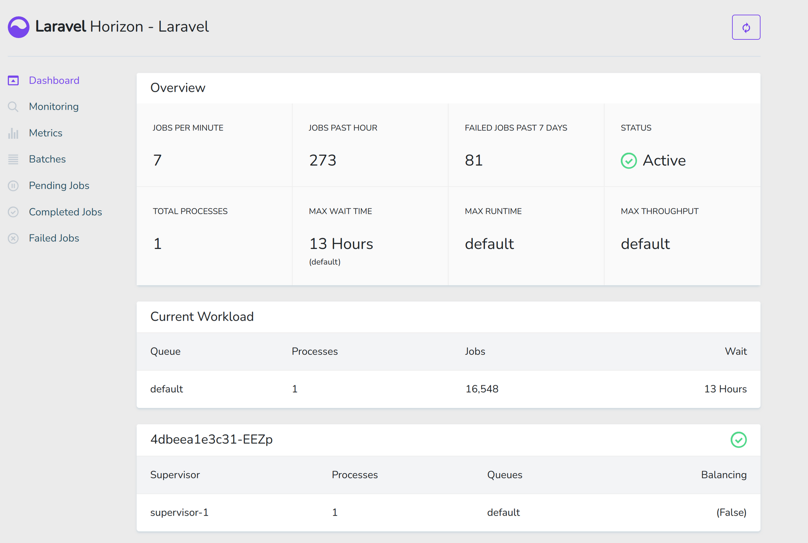

The Enjin Platform's new architecture has improved how data is handled, including retrieval, processing, and storage.

Key updates include:

- **Processor Container**: A new container decodes information and stores it in your local database.

- **Monitoring with Laravel Horizon**: Laravel Horizon is integrated for monitoring this processor container. It helps in tracking the status of jobs and pinpointing any failures.

- **Dashboard Access**: To view the processor container's activities, visit the Laravel Horizon dashboard at: http://localhost:8000/horizon/dashboard.

For more details on Laravel Horizon, refer to their documentation: https://laravel.com/docs/10.x/horizon.

