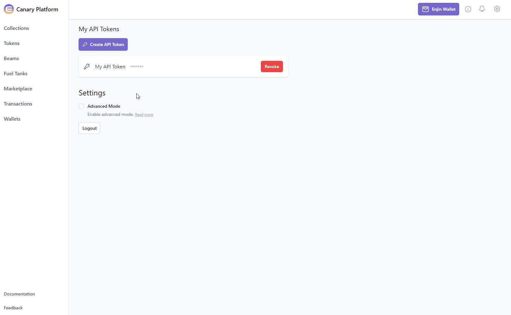
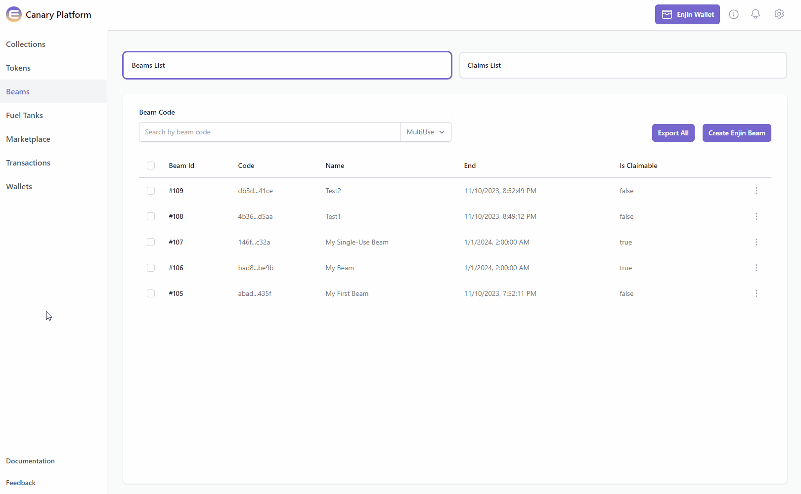

import GlossaryTerm from '@site/src/components/GlossaryTerm';
import Tabs from '@theme/Tabs';
import TabItem from '@theme/TabItem';

<GlossaryTerm id="enjin_beam" /> is a QR code-based distribution system that allows users to claim tokens directly into their Enjin Wallet. 

By scanning a Beam QR code, users can receive promotional items, collectibles, or other tokens as part of marketing campaigns or events.

This is a great way for you to onboard new users.

:::info What you'll need:
- Some [ Enjin Coin](/01-getting-started/02-using-enjin-coin.md) on Enjin Matrixchain to pay for <GlossaryTerm id="transaction_fees" /> and a deposit of 0.01 ENJ is required for the <GlossaryTerm id="token_account_deposit" />, for each new token holder.  
You can obtain cENJ (Canary ENJ) for testing from the [Canary faucet](https://faucet.canary.enjin.io/).
- An [Enjin Platform Account](/01-getting-started/03-using-the-enjin-platform.md).
- A [Collection](/02-tutorials/01-managing-tokens/01-creating-collections.md) and a [Token](/02-tutorials/01-managing-tokens/02-creating-tokens/02-creating-tokens.md) to mint.
:::

**There are two ways to create an Enjin Beam:**

1. [Using the Enjin Dashboard](#option-a-using-the-enjin-dashboard)
2. [Using the Enjin API & SDKs](#option-b-using-the-enjin-api--sdks)

## Option A. Using the Enjin Dashboard

In the Platform menu, navigate to "**[Beams](https://platform.canary.enjin.io/beams/list)**". Then, click the "**[Create Enjin Beam](https://platform.canary.enjin.io/create/beam)**" button.



Fill in the beam settings and optional arguments in the corresponding fields.

<p align="center">
  
</p>

Fill the tokens that you want to include in this Beam (You can add more tokens by adding the "**Add Token**" button)

<p align="center">
  
</p>

Once you're satisfied with the options, click on the "**Create**" button at the bottom right corner to create the request.  
If a signature request is needed, approve it.

Once the Beam is created, locate it in the "**Beams**" menu, click the **3 vertical dots** (**⋮**) to it's right, then click the "**Claim**" button to view the QR code.



:::warning Need to view multiple "Single-Use" QR codes?
Please note, viewing multiple "Single-Use" QR codes is currently not available in the Platform User Interface.  
For the time being, it can be viewed programmatically only via [Enjin API & SDKs](#option-b-using-the-enjin-api--sdks)
:::

The Enjin Beam is now ready to be shared to distribute tokens. Users can scan the QR code and instantly receive your token!  
Next skillset to learn is mutating a collection / token.  
Proceed to the [Freezing & Thawing](/02-tutorials/01-managing-tokens/07-freezing-thawing.md) tutorial to learn more.

## Option B. Using the Enjin API & SDKs

:::info Make sure to use the Beam Endpoint
- Testnet: `http://platform.canary.enjin.io/graphql/beam`
- Mainnet: `http://platform.enjin.io/graphql/beam`

**Try the Beam Playground here:**
- Testnet: http://platform.canary.enjin.io/graphiql/beam
- Mainnet: http://platform.enjin.io/graphiql/beam
:::

First, create the Beam with the parameters of your choice, such as name, description, image, begin and end date & the number of assets that you would like to distribute.

**Mutation:**

<Tabs>
  <TabItem value="graphql" label="GraphQL">
```graphql
mutation CreateBeam {
  CreateBeam(
    name: "My Beam" #Specify beam name
    description: "This is a test beam." #Specify beam description
    image: "https://assets-global.website-files.com/60f57c496975b84c29335fb7/60f58bd888a6e86e3ff69551_Enjin.svg"  #Specify url for beam image - shows during claim process
    start: "1st January 2023" #Specify start date
    end: "1st January 2024" #Specify end date
    collectionId: 36623 #Select the collection ID
    tokens: [{
      tokenIds: ["1..10", "123"] #Select the Token IDs. Use comma for multiple tokenIds: ["123", "234"], 2 dots for range: ["123", "234..345"]
      tokenQuantityPerClaim:1 #Specify the number of tokens a user can receive per claim
      claimQuantity:1 #Specify the number of times a user can claim
      type:MINT_ON_DEMAND #Select token distribution type
    }]
  )
}
```
  </TabItem>
  <TabItem value="curl" label="cURL">
```
curl --location 'https://platform.canary.enjin.io/graphql' \
-H 'Content-Type: application/json' \
-H 'Authorization: enjin_api_key' \
-d '{"query":"mutation CreateBeam(\r\n  $name: String!\r\n  $description: String!\r\n  $image: String!\r\n  $start: DateTime!\r\n  $end: DateTime!\r\n  $collection_id: BigInt!\r\n) {\r\n  CreateBeam(\r\n    name: $name\r\n    description: $description\r\n    image: $image\r\n    start: $start\r\n    end: $end\r\n    collectionId: $collection_id\r\n    tokens: [\r\n      {\r\n        tokenIds: [\"1..10\", \"123\"]\r\n        tokenQuantityPerClaim: 1\r\n        claimQuantity: 1\r\n        type: MINT_ON_DEMAND\r\n      }\r\n    ]\r\n  )\r\n}\r\n","variables":{"name":"My Beam","description":"This is a test beam.","image":"https://assets-global.website-files.com/60f57c496975b84c29335fb7/60f58bd888a6e86e3ff69551_Enjin.svg","start":"1st January 2023","end":"1st January 2024","collection_id":36623}}'
```
  </TabItem>
  <TabItem value="csharp-sdk" label="c# SDK">
```csharp
using System.Text.Json;
using Enjin.Platform.Sdk;
using Enjin.Platform.Sdk.Beam;

Cl
var tokens = new List<ClaimToken>
{
    new ClaimToken()
        .SetTokenIds(new List<IntegerRange>
            {
                new IntegerRange(1, 10),
                new IntegerRange(123)
            }.ToArray()
        )
        .SetClaimQuantity(1)
        .SetTokenQuantityPerClaim(1)
        .SetType(BeamType.MintOnDemand)
};

// Setup the mutation
var createBeam = new CreateBeam()
    .SetName("My Beam")
    .SetDescription("This is a test beam.")
    .SetImage("https://assets-global.website-files.com/60f57c496975b84c29335fb7/60f58bd888a6e86e3ff69551_Enjin.svg")
    .SetStart(new DateTime(2023, 1, 1))
    .SetEnd(new DateTime(2024, 1, 1))
    .SetCollectionId(36623)
    .SetTokens(tokens.ToArray());

// Create and auth a client to send the request to the platform
var client = PlatformClient.Builder()
    .SetBaseAddress("https://platform.canary.enjin.io")
    .Build();
client.Auth("Your_Platform_Token_Here");

// Send the request and write the output to the console.
// Only the fields that were requested in the fragment will be filled in,
// other fields which weren't requested in the fragment will be set to null.
var response = await client.SendCreateBeam(createBeam);
Console.WriteLine(JsonSerializer.Serialize(response.Result.Data));
```
  </TabItem>
  <TabItem value="cplusplus-sdk" label="C++ SDK">
```cpp
#include "EnjinPlatformSdkBeam/BeamMutations.hpp"
#include "EnjinPlatformSdkBeam/Beam.hpp"
#include <iostream>

using namespace enjin::platform::sdk;
using namespace enjin::platform::sdk::beam;
using namespace std;

int main() {

    // Define the list of tokens and claim parameters to include in the Beam
    vector<ClaimToken> claimTokens;
    vector<IntegerRange> integerRanges;
    integerRanges.emplace_back("1", "10");
    integerRanges.emplace_back("123");

    ClaimToken claimToken1 = ClaimToken()
            .SetTokenIds(make_shared<SerializableArray<IntegerRange>>(integerRanges))
            .SetClaimQuantity(make_shared<SerializableInt>(1))
            .SetTokenQuantityPerClaim(make_shared<SerializableInt>(1))
            .SetType(BeamType::MintOnDemand);

    claimTokens.push_back(claimToken1);

    DateTime startAt = DateTime::Parse("2023-01-01T00:00:00+0"); // Note the date string should be in ISO 8601 format.
    DateTime endAt = DateTime::Parse("2024-01-01T00:00:00+0"); // Note the date string should be in ISO 8601 format.

    // Setup mutation
    CreateBeam createBeam = CreateBeam()
            .SetName(make_shared<SerializableString>("My Beam"))
            .SetDescription(make_shared<SerializableString>("This is a test beam."))
            .SetImage(make_shared<SerializableString>("https://assets-global.website-files.com/60f57c496975b84c29335fb7/60f58bd888a6e86e3ff69551_Enjin.svg"))
            .SetStart(make_shared<DateTime>(startAt))
            .SetEnd(make_shared<DateTime>(endAt))
            .SetCollectionId(make_shared<SerializableString>("36623"))
            .SetTokens(make_shared<SerializableArray<ClaimToken>>(claimTokens));

    // Create and auth a client to send the request to the platform
    unique_ptr<PlatformClient> client = PlatformClient::Builder()
            .SetBaseAddress("https://platform.canary.enjin.io")
            .Build();
    client->Auth("Your_Platform_Token_Here");

    // Send the request then get the response and write the output to the console.
    // Only the fields that were requested in the fragment will be filled in,
    // other fields which weren't requested in the fragment will be set to null.
    future<PlatformResponsePtr<GraphQlResponse<std::string>>> futureResponse = SendCreateBeam(*client, createBeam);

    // Get the platform response holding the HTTP data
    PlatformResponsePtr<GraphQlResponse<std::string>> response = futureResponse.get();

    // Get the result, a GraphQL response, holding the GraphQL data
    const optional<GraphQlResponse<std::string>>& gqlResult = response->GetResult();

    // Write the result data to the console
    if (gqlResult.has_value() && gqlResult->IsSuccess())
    {
        const optional<std::string>& beamCode = gqlResult->GetData()->GetResult();

        std::cout << beamCode.value() << std::endl;
    }

    // Write any error messages to the console
    if (gqlResult.has_value() && gqlResult->HasErrors())
    {
        const optional<vector<GraphQlError>>& errors = gqlResult->GetErrors();

        for (const GraphQlError& error : errors.value()) {
            std::cout << error.GetMessage().value() << std::endl;
        }
    }

    client.reset();

    return 0;
}
```
  </TabItem>
  <TabItem value="js" label="Javascript">
```javascript
fetch('https://platform.canary.enjin.io/graphql', {
  method: 'POST',
  headers: {'Content-Type': 'application/json','Authorization': 'Your_Platform_Token_Here'},
  body: JSON.stringify({
    query: `
      mutation CreateBeam
      (
        $name: String!
        $description: String!
        $image: String!
        $start: DateTime!
        $end: DateTime!
        $collection_id: BigInt!
      ) {
        CreateBeam(
          name: $name
          description: $description
          image: $image
          start: $start
          end: $end
          collectionId: $collection_id
          tokens: [{
            tokenIds: ["1..10", "123"] #Select the Token IDs. Use comma for multiple tokenIds ["123", "234"], 2 dots for range: ["123", "234..345"]
            tokenQuantityPerClaim:1 #Specify the number of tokens a user can receive per claim
            claimQuantity:1 #Specify the number of times a user can claim
            type:MINT_ON_DEMAND #Select token distribution type
          }]
        )
      }
    `,
    variables: {
      name: "My Beam", //Specify beam name
      description: "This is a test beam.", //Specify beam description
      image: "https://assets-global.website-files.com/60f57c496975b84c29335fb7/60f58bd888a6e86e3ff69551_Enjin.svg", //Specify url for beam image - shows during claim process
      start: "1st January 2023", //Specify start date
      end: "1st January 2024", //Specify end date
      collection_id: 36623 //Select the collection ID
    }
  }),
})
.then(response => response.json())
.then(data => console.log(data));
```
  </TabItem>
  <TabItem value="nodejs" label="Node.js">
```javascript
const axios = require('axios');

axios.post('https://platform.canary.enjin.io/graphql', {
  query: `
    mutation CreateBeam
    (
      $name: String!
      $description: String!
      $image: String!
      $start: DateTime!
      $end: DateTime!
      $collection_id: BigInt!
    ) {
      CreateBeam(
        name: $name
        description: $description
        image: $image
        start: $start
        end: $end
        collectionId: $collection_id
        tokens: [{
          tokenIds: ["1..10" ,"123"] #Select the Token IDs. Use comma for multiple tokenIds: ["123", "234"], 2 dots for range: ["123", "234..345"]
          tokenQuantityPerClaim:1 #Specify the number of tokens a user can receive per claim
          claimQuantity:1 #Specify the number of times a user can claim
          type:MINT_ON_DEMAND #Select token distribution type
        }]
      )
    }
  `,
  variables: {
    name: "My Beam", //Specify beam name
    description: "This is a test beam.", //Specify beam description
    image: "https://assets-global.website-files.com/60f57c496975b84c29335fb7/60f58bd888a6e86e3ff69551_Enjin.svg", //Specify url for beam image - shows during claim process
    start: "1st January 2023", //Specify start date
    end: "1st January 2024", //Specify end date
    collection_id: 36623 //Select the collection ID
  }
}, {
  headers: {'Content-Type': 'application/json','Authorization': 'Your_Platform_Token_Here'}
})
.then(response => console.log(response.data))
.catch(error => console.error(error));
```
  </TabItem>
  <TabItem value="python" label="Python">
```python
import requests

query = '''
mutation CreateBeam
(
  $name: String!
  $description: String!
  $image: String!
  $start: DateTime!
  $end: DateTime!
  $collection_id: BigInt!
) {
  CreateBeam(
    name: $name
    description: $description
    image: $image
    start: $start
    end: $end
    collectionId: $collection_id
    tokens: [{
      tokenIds: ["1..10", "123"] #Select the Token IDs. Use comma for multiple tokenIds: ["123", "234"], 2 dots for range: ["123", "234..345"]
      tokenQuantityPerClaim:1 #Specify the number of tokens a user can receive per claim
      claimQuantity:1 #Specify the number of times a user can claim
      type:MINT_ON_DEMAND #Select token distribution type
    }]
  )
}
'''

variables = {
  'name': "My Beam", #Specify beam name
  'description': "This is a test beam.", #Specify beam description
  'image': "https://assets-global.website-files.com/60f57c496975b84c29335fb7/60f58bd888a6e86e3ff69551_Enjin.svg", #Specify url for beam image - shows during claim process
  'start': "1st January 2023", #Specify start date
  'end': "1st January 2024", #Specify end date
  'collection_id': 36623 #Select the collection ID
}

response = requests.post('https://platform.canary.enjin.io/graphql',
  json={'query': query, 'variables': variables},
  headers={'Content-Type': 'application/json', 'Authorization': 'Your_Platform_Token_Here'}
)
print(response.json())
```
  </TabItem>
</Tabs>

Next you will need to send a query to get one of the two different code types.

- **Multi-Use Codes: **Useful for advertising.
- **Single-Use Codes: **Useful for rewarding individuals.

**Query: Multi-Use Codes**

<Tabs>
  <TabItem value="graphql" label="GraphQL">
```graphql
query GetBeam {
  GetBeam(code: "adab7ac8bda71c2e2bf8a3228f0a435f") { #Set the beam code
    id
    code
    name
    description
    image
    start
    end
    isClaimable
    claimsRemaining    
    qr {
      url
      payload
    }
    collection {
      collectionId
      maxTokenCount
      maxTokenSupply
      forceSingleMint
      frozen
      network
    }    
  }
}
```
  </TabItem>
  <TabItem value="curl" label="cURL">
```
curl --location 'https://platform.canary.enjin.io/graphql' \
-H 'Content-Type: application/json' \
-H 'Authorization: enjin_api_key' \
-d '{"query":"query GetBeam($code: String!) {\r\n  GetBeam(code: $code) {\r\n    id\r\n    code\r\n    name\r\n    description\r\n    image\r\n    start\r\n    end\r\n    isClaimable\r\n    claimsRemaining\r\n    qr {\r\n      url\r\n      payload\r\n    }\r\n    collection {\r\n      collectionId\r\n      maxTokenCount\r\n      maxTokenSupply\r\n      forceSingleMint\r\n      frozen\r\n      network\r\n    }\r\n  }\r\n}\r\n","variables":{"code":"adab7ac8bda71c2e2bf8a3228f0a435f"}}'
```
  </TabItem>
  <TabItem value="csharp-sdk" label="c# SDK">
```csharp
using System.Text.Json;
using Enjin.Platform.Sdk;
using Enjin.Platform.Sdk.Beam;

// Setup the query
var getBeam = new GetBeam()
    .SetCode("adab7ac8bda71c2e2bf8a3228f0a435f");

// Define and assign the return data fragment to the query
var beamFragment = new BeamFragment()
    .WithId()
    .WithCode()Wi
    .WithName()
    .WithDescription()
    .WithImage()
    .WithStart()
    .WithEnd()
    .WithQr(new BeamQrFragment()
        .WithUrl()
        .WithPayload()
    )
    .WithCollection(new CollectionFragment()
        .WithCollectionId()
        .WithMaxTokenCount()
        .WithMaxTokenSupply()
        .WithForceSingleMint()
        .WithFrozen()
        .WithNetwork()
    );

// Create and auth a client to send the request to the platform
var client = PlatformClient.Builder()
    .SetBaseAddress("https://platform.canary.enjin.io")
    .Build();
client.Auth("Your_Platform_Token_Here");

// Send the request and write the output to the console.
// Only the fields that were requested in the fragment will be filled in,
// other fields which weren't requested in the fragment will be set to null.
var response = await client.SendGetBeam(getBeam);
Console.WriteLine(JsonSerializer.Serialize(response.Result.Data));
```
  </TabItem>
  <TabItem value="cplusplus-sdk" label="C++ SDK">
```cpp
#include "EnjinPlatformSdkBeam/BeamQueries.hpp"
#include "EnjinPlatformSdkBeam/Beam.hpp"
#include <iostream>

using namespace enjin::platform::sdk;
using namespace enjin::platform::sdk::beam;
using namespace std;

int main() {

    // Set up the query
    GetBeam getBeam = GetBeam()
            .SetCode(make_shared<SerializableString>("adab7ac8bda71c2e2bf8a3228f0a435f"));

    // Define the fragment for the returned data
    BeamFragment beamFragment = BeamFragment()
            .WithId()
            .WithCode()
            .WithName()
            .WithDescription()
            .WithImage()
            .WithStart()
            .WithEnd()
            .WithQr(make_shared<BeamQrFragment>(
                    BeamQrFragment()
                    .WithUrl()
                    .WithPayload()
                )
            )
            .WithCollection(make_shared<CollectionFragment>(
                    CollectionFragment()
                    .WithCollectionId()
                    .WithMaxTokenCount()
                    .WithMaxTokenSupply()
                    .WithForceSingleMint()
                    .WithFrozen()
                    .WithNetwork()
                )
            );

    getBeam.SetFragment(make_shared<BeamFragment>(beamFragment));

    // Create and auth a client to send the request to the platform
    unique_ptr<PlatformClient> client = PlatformClient::Builder()
            .SetBaseAddress("https://platform.canary.enjin.io")
            .Build();
    client->Auth("Your_Platform_Token_Here");

    // Send the request then get the response and write the output to the console.
    // Only the fields that were requested in the fragment will be filled in,
    // other fields which weren't requested in the fragment will be set to null.
    future<PlatformResponsePtr<GraphQlResponse<Beam>>> futureResponse = SendGetBeam(*client, getBeam);

    // Get the platform response holding the HTTP data
    PlatformResponsePtr<GraphQlResponse<Beam>> response = futureResponse.get();

    // Get the result, a GraphQL response, holding the GraphQL data
    const optional<GraphQlResponse<Beam>>& gqlResult = response->GetResult();

    // Write the result data to the console
    if (gqlResult.has_value() && gqlResult->IsSuccess())
    {
        const optional<Beam>& beam = gqlResult->GetData()->GetResult();

        std::cout << beam->GetCode().value() << std::endl;
    }

    // Write any error messages to the console
    if (gqlResult.has_value() && gqlResult->HasErrors())
    {
        const optional<vector<GraphQlError>>& errors = gqlResult->GetErrors();

        for (const GraphQlError& error : errors.value()) {
            std::cout << error.GetMessage().value() << std::endl;
        }
    }
  
    client.reset();

    return 0;
}
```
  </TabItem>
  <TabItem value="js" label="Javascript">
```javascript
fetch('https://platform.canary.enjin.io/graphql', {
  method: 'POST',
  headers: {'Content-Type': 'application/json','Authorization': 'Your_Platform_Token_Here'},
  body: JSON.stringify({
    query: `
      query GetBeam
      (
        $code: String!
      ) {
        GetBeam(code: $code) {
          id
          code
          name
          description
          image
          start
          end
          isClaimable
          claimsRemaining    
          qr {
            url
            payload
          }
          collection {
            collectionId
            maxTokenCount
            maxTokenSupply
            forceSingleMint
            frozen
            network
          }    
        }
      }
    `,
    variables: {
      code: "adab7ac8bda71c2e2bf8a3228f0a435f" //Set the beam code
    }
  }),
})
.then(response => response.json())
.then(data => console.log(data));
```
  </TabItem>
  <TabItem value="nodejs" label="Node.js">
```javascript
const axios = require('axios');

axios.post('https://platform.canary.enjin.io/graphql', {
  query: `
    query GetBeam
    (
      $code: String!
    ) {
      GetBeam(code: $code) {
        id
        code
        name
        description
        image
        start
        end
        isClaimable
        claimsRemaining    
        qr {
          url
          payload
        }
        collection {
          collectionId
          maxTokenCount
          maxTokenSupply
          forceSingleMint
          frozen
          network
        }    
      }
    }
  `,
  variables: {
    code: "adab7ac8bda71c2e2bf8a3228f0a435f" //Set the beam code
  }
}, {
  headers: {'Content-Type': 'application/json','Authorization': 'Your_Platform_Token_Here'}
})
.then(response => console.log(response.data))
.catch(error => console.error(error));
```
  </TabItem>
  <TabItem value="python" label="Python">
```python
import requests

query = '''
query GetBeam
(
  $code: String!
) {
  GetBeam(code: $code) {
    id
    code
    name
    description
    image
    start
    end
    isClaimable
    claimsRemaining    
    qr {
      url
      payload
    }
    collection {
      collectionId
      maxTokenCount
      maxTokenSupply
      forceSingleMint
      frozen
      network
    }    
  }
}
'''

variables = {
  'code': "adab7ac8bda71c2e2bf8a3228f0a435f" #Set the beam code
}

response = requests.post('https://platform.canary.enjin.io/graphql',
  json={'query': query, 'variables': variables},
  headers={'Content-Type': 'application/json', 'Authorization': 'Your_Platform_Token_Here'}
)
print(response.json())
```
  </TabItem>
</Tabs>

**Query: Single-Use Codes**

<Tabs>
  <TabItem value="graphql" label="GraphQL">
```graphql
query GetSingleUseCodes {
  GetSingleUseCodes(code: "adab7ac8bda71c2e2bf8a3228f0a435f") { #Set the beam code
    edges {
      cursor
      node {
        qr {
          url
        }
      }
    }
    totalCount
    pageInfo {
      hasPreviousPage
      hasNextPage
      startCursor
      endCursor
    }
  }
}
```
  </TabItem>
  <TabItem value="curl" label="cURL">
```
curl --location 'https://platform.canary.enjin.io/graphql' \
-H 'Content-Type: application/json' \
-H 'Authorization: enjin_api_key' \
-d '{"query":"query GetSingleUseCodes($code: String!) {\r\n  GetSingleUseCodes(code: $code) {\r\n    edges {\r\n      cursor\r\n      node {\r\n        qr {\r\n          url\r\n        }\r\n      }\r\n    }\r\n    totalCount\r\n    pageInfo {\r\n      hasPreviousPage\r\n      hasNextPage\r\n      startCursor\r\n      endCursor\r\n    }\r\n  }\r\n}\r\n","variables":{"code":"adab7ac8bda71c2e2bf8a3228f0a435f"}}'
```
  </TabItem>
  <TabItem value="csharp-sdk" label="c# SDK">
```csharp
using System.Text.Json;
using Enjin.Platform.Sdk;
using Enjin.Platform.Sdk.Beam;

// Setup the query
var getSingleUseCodes = new GetSingleUseCodes()
    .SetCode("adab7ac8bda71c2e2bf8a3228f0a435f");

// Define and assign the return data fragment to the query
var beamConnectionFragment = new ConnectionFragment<BeamClaimFragment>()
		.WithEdges(new EdgeFragment<BeamClaimFragment>()
        .WithCursor()
        .WithNode(new BeamClaimFragment()
            .WithQr(
                new BeamQrFragment()
                    .WithUrl()
            )
        )
    )
    .WithTotalCount()
    .WithPageInfo(new PageInfoFragment()
        .WithHasPreviousPage()
        .WithHasNextPage()
        .WithStartCursor()
        .WithEndCursor()
    );

getSingleUseCodes.Fragment(beamConnectionFragment);

// Create and auth a client to send the request to the platform
var client = PlatformClient.Builder()
    .SetBaseAddress("https://platform.canary.enjin.io")
    .Build();
client.Auth("Your_Platform_Token_Here");

// Send the request and write the output to the console.
// Only the fields that were requested in the fragment will be filled in,
// other fields which weren't requested in the fragment will be set to null.
var response = await client.SendGetSingleUseCodes(getSingleUseCodes);
Console.WriteLine(JsonSerializer.Serialize(response.Result.Data));
```
  </TabItem>
  <TabItem value="cplusplus-sdk" label="C++ SDK">
```cpp
#include "EnjinPlatformSdkBeam/BeamQueries.hpp"
#include "EnjinPlatformSdkBeam/Beam.hpp"
#include <iostream>

using namespace enjin::platform::sdk;
using namespace enjin::platform::sdk::beam;
using namespace std;

int main() {

    // Set up the query
    GetSingleUseCodes getSingleUseCodes = GetSingleUseCodes()
            .SetCode(make_shared<SerializableString>("adab7ac8bda71c2e2bf8a3228f0a435f"));

    // Define Fragments for the returned data
    BeamClaimFragment beamClaimFragment = BeamClaimFragment();
    BeamQrFragment beamQrFragment = BeamQrFragment().WithUrl();
    beamClaimFragment.WithQr(make_shared<BeamQrFragment>(beamQrFragment));

    PageInfoFragment pageInfoFragment = PageInfoFragment()
            .WithHasPreviousPage()
            .WithHasNextPage()
            .WithHasStartCursor()
            .WithHasEndCursor();

    // Connection fragments are used for paginated data
    ConnectionFragment<BeamClaimFragment> beamConnectionFragment = ConnectionFragment<BeamClaimFragment>()
            .WithEdges(
                make_shared<EdgeFragment<BeamClaimFragment>>(
                    EdgeFragment<BeamClaimFragment>()
                    .WithCursor()
                    .WithNode(make_shared<BeamClaimFragment>(beamClaimFragment))
                )
            )
            .WithTotalCount()
            .WithPageInfo(make_shared<PageInfoFragment>(pageInfoFragment));


    getSingleUseCodes.SetFragment(make_shared<ConnectionFragment<BeamClaimFragment>>(beamConnectionFragment));

    // Create and auth a client to send the request to the platform
    unique_ptr<PlatformClient> client = PlatformClient::Builder()
            .SetBaseAddress("https://platform.canary.enjin.io")
            .Build();
    client->Auth("Your_Platform_Token_Here");

    // Send the request then get the response and write the output to the console.
    // Only the fields that were requested in the fragment will be filled in,
    // other fields which weren't requested in the fragment will be set to null.
    future<PlatformResponsePtr<GraphQlResponse<Connection<BeamClaim>>>> futureResponse = SendGetSingleUseCodes(*client, getSingleUseCodes);

    // Get the platform response holding the HTTP data
    PlatformResponsePtr<GraphQlResponse<Connection<BeamClaim>>> response = futureResponse.get();

    // Get the result, a GraphQL response, holding the GraphQL data
    const optional<GraphQlResponse<Connection<BeamClaim>>>& gqlResult = response->GetResult();

    // Write the result data to the console
    if (gqlResult.has_value() && gqlResult->IsSuccess())
    {
        const optional<Connection<BeamClaim>>& singleUseCodes = gqlResult->GetData()->GetResult();

        std::cout << singleUseCodes->GetTotalCount().value() << std::endl;
    }

    // Write any error messages to the console
    if (gqlResult.has_value() && gqlResult->HasErrors())
    {
        const optional<vector<GraphQlError>>& errors = gqlResult->GetErrors();

        for (const GraphQlError& error : errors.value()) {
            std::cout << error.GetMessage().value() << std::endl;
        }
    }

    client.reset();

    return 0;
}

```
  </TabItem>
  <TabItem value="js" label="Javascript">
```javascript
fetch('https://platform.canary.enjin.io/graphql', {
  method: 'POST',
  headers: {'Content-Type': 'application/json','Authorization': 'Your_Platform_Token_Here'},
  body: JSON.stringify({
    query: `
      query GetSingleUseCodes
      (
        $code: String!
      ) {
        GetSingleUseCodes(code: $code) {
          edges {
            cursor
            node {
              qr {
                url
              }
            }
          }
          totalCount
          pageInfo {
            hasPreviousPage
            hasNextPage
            startCursor
            endCursor
          }
        }
      }
    `,
    variables: {
      code: "adab7ac8bda71c2e2bf8a3228f0a435f" //Set the beam code
    }
  }),
})
.then(response => response.json())
.then(data => console.log(data));
```
  </TabItem>
  <TabItem value="nodejs" label="Node.js">
```javascript
const axios = require('axios');

axios.post('https://platform.canary.enjin.io/graphql', {
  query: `
    query GetSingleUseCodes
    (
      $code: String!
    ) {
      GetSingleUseCodes(code: $code) {
        edges {
          cursor
          node {
            qr {
              url
            }
          }
        }
        totalCount
        pageInfo {
          hasPreviousPage
          hasNextPage
          startCursor
          endCursor
        }
      }
    }
  `,
  variables: {
    code: "adab7ac8bda71c2e2bf8a3228f0a435f" //Set the beam code
  }
}, {
  headers: {'Content-Type': 'application/json','Authorization': 'Your_Platform_Token_Here'}
})
.then(response => console.log(response.data))
.catch(error => console.error(error));
```
  </TabItem>
  <TabItem value="python" label="Python">
```python
import requests

query = '''
query GetSingleUseCodes
(
  $code: String!
) {
  GetSingleUseCodes(code: $code) {
    edges {
      cursor
      node {
        qr {
          url
        }
      }
    }
    totalCount
    pageInfo {
      hasPreviousPage
      hasNextPage
      startCursor
      endCursor
    }
  }
}
'''

variables = {
  'code': "adab7ac8bda71c2e2bf8a3228f0a435f" #Set the beam code
}

response = requests.post('https://platform.canary.enjin.io/graphql',
  json={'query': query, 'variables': variables},
  headers={'Content-Type': 'application/json', 'Authorization': 'Your_Platform_Token_Here'}
)
print(response.json())
```
  </TabItem>
</Tabs>

:::tip This query might return items in different pages using Connections
To learn how to use GraphQL cursors for pagination, head to [Using the API --> Pagination](/01-getting-started/04-using-enjin-api/01-how-to-use-graphql.md#pagination).
:::

The Enjin Beam is now ready to be shared to distribute tokens. Users can scan the QR code and instantly receive your token!

:::info Explore More Arguments
For a comprehensive view of all available arguments for queries and mutations, please refer to our [API Reference](/01-getting-started/04-using-enjin-api/02-api-reference.md). This resource will guide you on how to use the GraphiQL Playground to explore the full structure and functionality of our API.

For instance, you'll find settings such as different Beam flags types with the `Flags` argument.
:::

:::tip What's next?
Proceed to the [Freezing & Thawing](/02-tutorials/01-managing-tokens/07-freezing-thawing.md) tutorial to learn more.
:::
