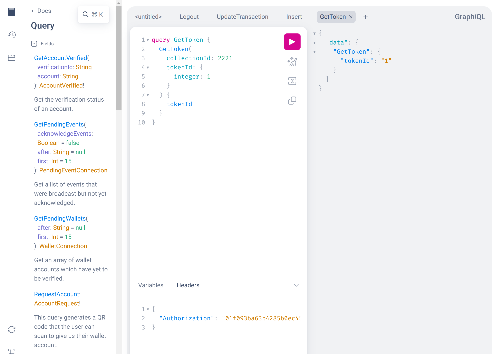

# Running it locally

The [Open-Source Enjin Platform](https://github.com/enjin/platform) was made to be as simple as possible to run, you will be able to have a full running environment in less than 5 minutes.

## 1\. Install Dependencies

We have two dependencies that must be installed in your server or computer, git, a command line version control system, you can download it here: https://git-scm.com/downloads

And docker, you may install either the [docker engine](https://docs.docker.com/engine/install/) or [docker desktop](https://www.docker.com/products/docker-desktop), though for people that have never used docker before we recommend using docker desktop: https://www.docker.com/products/docker-desktop

## 2\. Clone the Repository

In order for this to work you have to clone the repository, please note that downloading it as a zip will generate problems with the submodules.

To clone the repository just run the following command in the Terminal or Command Prompt in the folder where you want to download the platform.

```bash
git clone https://github.com/enjin/platform
```

:::info Logging in
You login by editing the `configs/core/.env file`. Here, you use the `DAEMON_ACCOUNT` and `BASIC_AUTH_TOKEN` environment variables for the wallet account and API token, respectively.
:::

## 3\. Run the Start Script

In the main folder of the platform, there are two start scripts: `start.bat` for Windows and `start.sh` for macOS and Linux. 

Running either script sets everything up automatically. 

### Running the Start script on Windows

To run the Start script on windows, simply double click the `start.bat` file.

### Running the Start script on MacOS / Linux

To run the Start script on MacOS / Linux, open your Terminal application on MacOS, or establish an SSH connection to your Linux server.  
Then, navigate to the platform's root directory using the `cd platform` command, and start the script using the following command:

```bash
./start.sh
```

***

A sample output is available to show what happens during this process.

```text
Welcome to Enjin Platform, this script will help you start it up
For a few things to work, we need to know your platform URL
Please input the URL: (e.g. http://127.0.0.1)
http://127.0.0.1

Laravel uses an app key to protect your data with encryption
Your APP_KEY is not set, do you want to generate one? (y/n)
y

Done, your key is: base64:CGAdVfzKICzydRuipAxt9UxlbfMjggDiiT52T7P9H0A=
We also use a static token to protect your platform from unauthorized access
Your BASIC_AUTH_TOKEN is not set, do you want to generate one? (y/n)
y

Done, your basic static token is: 01f093ba63b4285b0ec451f406e3d8580f28ec32b97ac7e97f3e4bed31b44907
Finally, we also use a password to protect your wallet daemon
Your KEY_PASS is not set, do you want to generate one? (y/n)
y

Done, your daemon password is: 0c0b44096a6f54d3ab92aff019a7dd5ecf383fd0df908e71aec34b62145e96e5

[+] Building 11.8s (26/26) FINISHED  
............

Let's get your wallet daemon address, please wait...
[+] Running 1/1
 ✔ Container platform-daemon-1  Started  

Your wallet daemon address is: efUGPaFNbV3JyqEfv27eRWkQ2tcMd5ympi83p1c2q5VUXPttv
Do you want to start all platform services? (y/n)
y

[+] Building 179.1s (141/167)                                                                                                                                                                                      
...............

[+] Running 8/8
 ✔ Container platform-decoder-1    Started
 ✔ Container platform-redis-1      Running
 ✔ Container platform-daemon-1     Running
 ✔ Container platform-database-1   Running
 ✔ Container platform-websocket-1  Started
 ✔ Container platform-app-1        Started
 ✔ Container platform-ingest-1     Started
 ✔ Container platform-beam-1       Started  

Your Enjin Platform is now running, please visit: http://localhost:8000/graphiql
```

## 4\. Choose Your Network

For the Enjin Platform Starter, the default network is set to `enjin-matrixchain` (mainnet). You can switch different networks by editing NETWORK variable in the `configs/core/.env` file.  
Accepted values are `enjin-matrixchain` / `canary-matrixchain` / `local-matrixchain`.

:::info To apply the changes, run without caching
When starting the Enjin Platform using the start script, it builds the Docker image with caching. If you've modified the `.env` variables, rebuild using `docker compose build --no-cache` to apply these changes.
:::

## 5\. Access the Platform

There are two ways of interacting with Enjin Platform, through the GraphQL API. For testing you can use the GraphiQL playground that will be accessible at http://localhost:8000/graphiql



But you can also use the Enjin Platform UI which you can access at `http://localhost:8000`, you might see this setup screen where you should enter the `BASIC_AUTH_TOKEN` that was shown to you in the setup script. 


After that, you will be able to navigate through the UI and create collections, tokens, fuel tanks, and everything that the Enjin Platform provides to you.

## 6\. Make the platform publicly accessible

Creating a public URL using ngrok

**Step 1:** Download ngrok from the official website: https://ngrok.com/download

**Step 2:** Unzip to Install

On Linux, or macOS you can unzip ngrok from a terminal with the following command. On Windows, just click on ngrok.zip to extract it.

`$unzip /path/to/ngrok.zip`

**Step 3:** Connect your account

Running this command will add your auth token to the default ngrok.yml configuration file. This will grant you access to more features and longer session time.

`$ngrok config add-authtoken ONE_AUTH_TOKEN_HERE`

**Step 4:** Running ngrok

Read the documentation here, Try it out by running it from the command line:

`$ ngrok help`

To start an HTTP tunnel forwarding to your local port 8000, run this next:

`$ ngrok http 8000`

Once you have run the command from above, the example should appear as the following, where the URL shown is the URL of your project.

In case you want to access the GraphQL playground, you would just need to add /graphiql at the end of your HTTP

## 7\. Upgrade to latest version

** Step 1:** **Update the submodules** by navigating to each of the `platform-decoder` and `wallet-daemon` folders and run:

```bash
git checkout master && git pull
```

**Step 2:** **Rebuild the docker images** with no-cache from the root of the platform:

```bash
docker compose build --no-cache
```

**Step 3:** **Run the container** by running this code from the root of the platform:

```bash
docker compose up -d
```

## 8\. Configure Collections (Optional)

By default, the Enjin Platform syncs token data from all of the collections in the Blockchain.  
To save storage and sync time, you can configure the Enjin Platform to sync only selected collections.  
To do that, head over to http://localhost:8000/graphiql and run the `AddToTracked` mutation, with the IDs of the collections you wish to sync, like so:

```graphql
mutation SyncCollections{
  AddToTracked(type: COLLECTION, chainIds: ["30710", "42100"])
}
```
