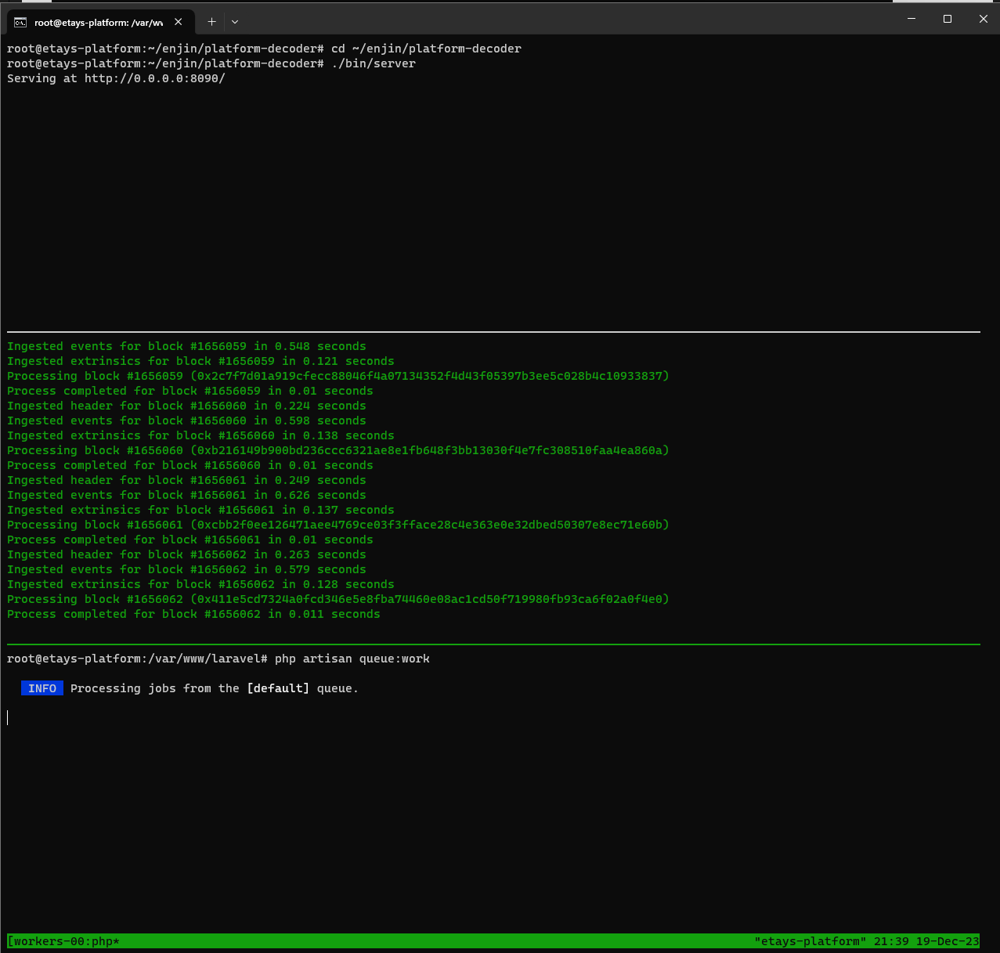

:::tip
Before syncing for the first time it would be recommended to increase your droplet ram amount to at least 4GB.  You will be able to scale back afterwards for normal day-to-day use as determined by your needs.
:::

1. For full functionality it is recommended to sync the platform and start ingesting blockchain events, along with starting the queue worker so events are processed.  We can do this by running these commands on the platform server using a new tmux session:

   ```bash
   tmux new -t workers
   ```

2. Once the session is open create a new pane using `ctrl-b` followed by double quotes (`"`), do this twice so we have three panels open and can run and monitor both workers and the decoder simultaneously then switch to the first pane using `ctrl-b` followed by `up-arrow` twice.  
   First we will run the decoder that we built earlier:

   ```bash
   cd ~/enjin/platform-decoder

   ./bin/server
   ```

3. Now, we will run the platform sync and ingest commands  
   Switch to the next pane using `ctrl-b` followed by `down-arrow` and then run the sync command. It will take a few minutes, don't worry if it looks like it gets stuck at around 80%, it'll still be churning through data:

   ```bash
   cd /var/www/laravel/

   php artisan platform:sync
   ```

4. Once the sync is complete run the ingest worker command to start receiving and processing blockchain events:

   ```bash
   php artisan platform:ingest
   ```

5. While the middle pane is working,  
   Switch to the lower pane using `ctrl-b` followed by `down-arrow` and then run the queue worker which will process and broadcast the platform events, along with any jobs as required:

   ```bash
   cd /var/www/laravel/

   php artisan queue:work
   ```



Your platform setup is now complete and you can start querying blockchain data and creating transactions for your wallet daemon to sign.

To use the GraphQL API, send your requests to the droplet's `<public_ip>/graphql` or `yourdomain.com/graphql` if you hooked up your domain to the droplet in your providers DNS at the droplet configuration stage.

You can also use the GraphiQL playground at `<public_ip>/graphiql`, or `yourdomain.com/graphiql` (notice the extra `i` in the URL) if you hooked up your domain to the droplet in your providers DNS at the droplet configuration stage.

Once the workers are running you can detach from the session using `ctrl-b` followed by `d`.  
To reattach to your worker session use this command in the terminal: `tmux a -t workers`  
There are other useful commands you can use with `tmux`, check this resource for more information https://tmuxcheatsheet.com/
