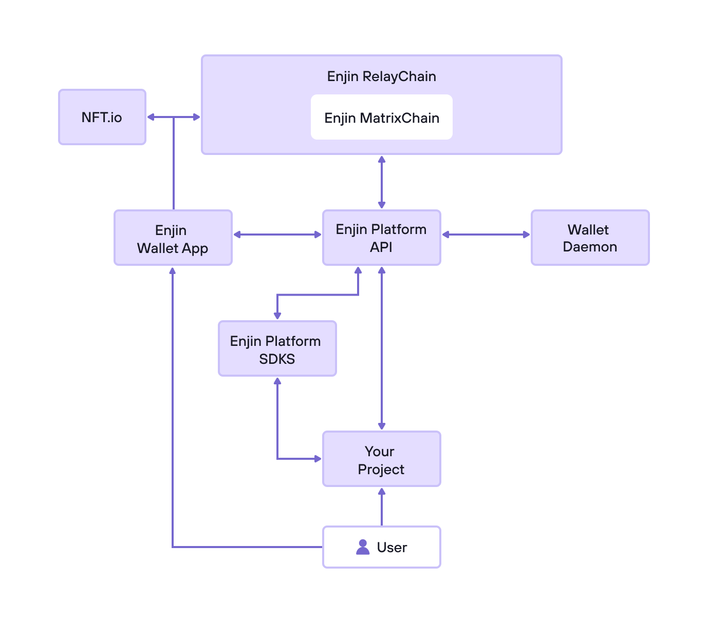

Enjin is the ideal blockchain platform for your game or business due to its gaming roots and the powerful Relaychain infrastructure that it's built upon. The Enjin ecosystem comprises the Enjin Platform, NFT.io, Enjin Wallet 2.0, Beam, SDKs, and other tools and services that allow game and app developers to boost their revenue, gain a competitive advantage, and innovate in ways that were previously impossible.

Enjin's tools and services, originally developed for gaming, are versatile and applicable to businesses of all sizes and industries. Whether seeking to create blockchain products or utilize tokenized digital assets for acquisition, retention, engagement, and monetization strategies, Enjin's expertise can be a valuable resource.  
The Enjin Platform is a powerful Platform as a Service (PaaS) for blockchain technology, designed to simplify the creation and administration of blockchain games.

Unlike traditional blockchain game development that requires building and maintaining complex infrastructure, the Enjin Platform offers a comprehensive, and adaptable set of tools and services. With Enjin's Blockchain SDKs, Platform API, and Automation services such as the wallet Daemon, game developers can revolutionize the creation of blockchain games. The Enjin Platform also incorporates Enjin Relaychain and Enjin Matrixchain, which serve as the blockchain backbone of the entire system.

  

The Enjin Ecosystem provides numerous advantages, one of which is the ability to leverage innovative crowdfunding models. With this platform, you can create gaming assets such as characters, weapons, and real estate ahead of time and offer them to gamers through conventional crowdfunding platforms or a custom website powered by NFT.io. Using Beam, the world's first QR-based blockchain asset distribution service, assets can be easily shared with QR codes. Furthermore, you can facilitate user-driven value creation by enabling players to modify, craft, upgrade, build, and trade blockchain-based gaming assets, which can gain intrinsic value based on their history, stats, utility, and customization.

Enjin's Ecosystem provides benefits beyond just cutting-edge crowdfunding models, including the establishment of user loyalty and trust through true ownership of digital gaming assets. This ownership leads to more loyal users who are more likely to make lost revenue by eliminating gray market trading, which can account for up to 40% of lost revenue. Furthermore, player churn can be reduced by ensuring gaming assets are owned by gamers and safely stored in their private Enjin Wallet, which requires approval for each transaction, thus making hacking or in-game fraud impossible.

  

The Enjin Platform's versatility extends beyond gaming to a variety of other use cases. For instance, you can transform artwork into NFTs, allowing for easy display in virtual galleries or as proof of ownership for physical pieces.

New technology allows you to produce music and convert it into a powerful token with exclusive rights. You can also tokenize physical collectibles like vintage comics, rare paintings, and real estate.

Furthermore, you can design unique, easily tradeable, and programmable digital collectibles that convey a compelling narrative and leverage the Enjin Platform's 3D modeling support to create a fully immersive VR and AR experience with tokenized assets.
