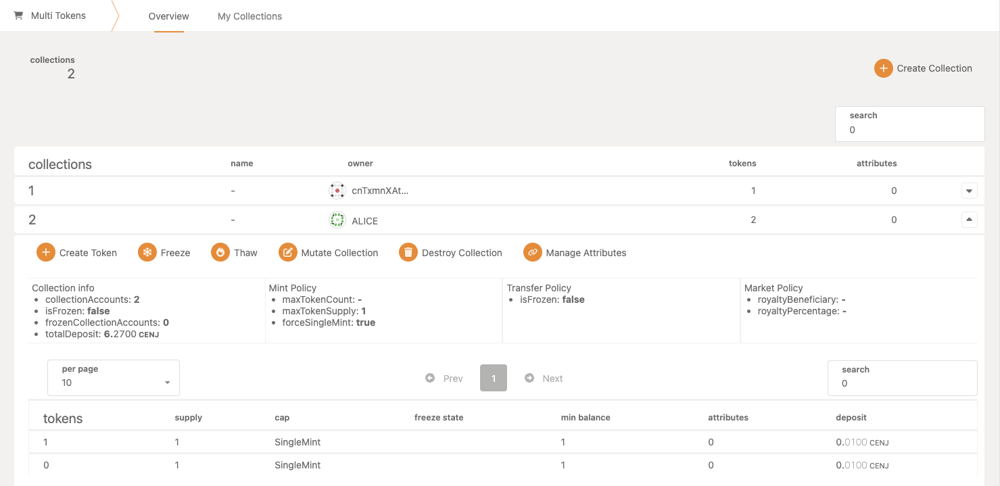
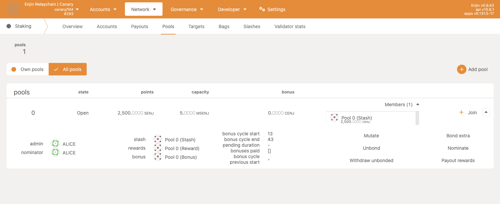
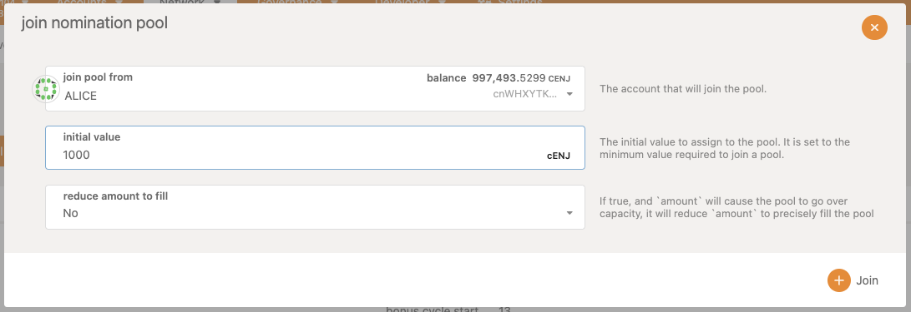
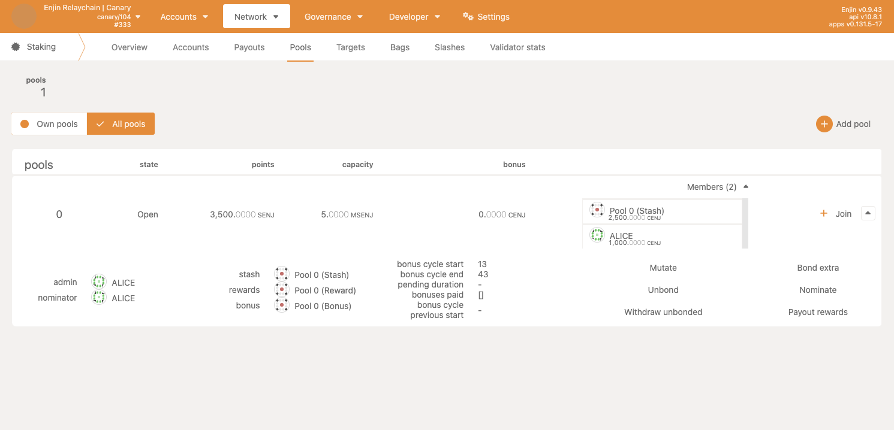
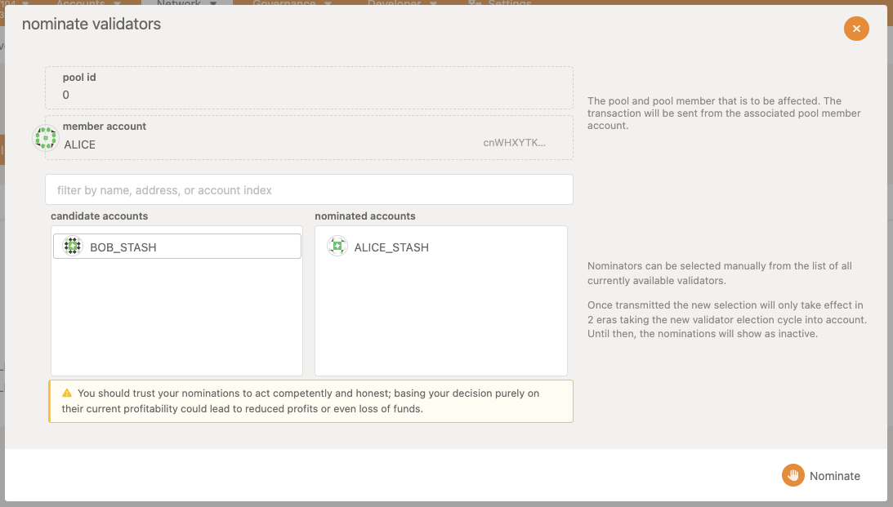

## Creating nomination pools

Enjin Relaychain uses Nominated Proof of Stake (NPoS) to secure the network. Nominators can select which validators to delegate the stake to. A nomination pool acts as a single nominator and lowers the entry barrier for the user to participate in NPoS.

## Degen NFT

To create a nomination pool, an account must hold a Degen NFT.

A Degen NFT is a special token that is used to create the pool and the holder might receive pool commissions, the collection for all Degen NFTs has a fixed ID of `2`.

## Create a nomination pool (RAW extrinsic)

Once you hold a Degen NFT, you can create a nomination pool using `nominationPools.create()`.

## Create a nomination pool (Enjin Console)

[Enjin Console](https://console.enjin.io/) has custom UI that simplifies this process, its located under `Network -> Staking -> Pools`

This page allows to create a nomination pool, see an overview, and manage its settings. Let's create a new pool and fill out the form.

Important to keep in mind:

- Creating a pool requires a Degen NFT (`tokenId` must be provided)
- Minimum initial stake deposit is required to create a pool (`2500 ENJ`)
- `Duration` must be at least `30 eras` (30 days) and not more than `1000 eras` (1000 days)

## Creation parameters

It's worth noting that `tokenId` is the ID of the Degen NFT you hold. `PoolId` may or may not match the `tokenId`, this wont change anything, but is worth keeping in mind. Duration is defined in `eras`, where `1 era = 24 hours` on Enjin Relaychain, and minimum value is set at `30 eras`.

## Pool created

Now the nomination pool is created and the initial stake is deposited. You can also notice that the only member is the Pool stash account.

## Join a nomination pool

Now you can also join the pool, and provide your own stake.

## Pool overview

Once you have joined the pool, you can check the overview of the pool, and the members list should be updated.

The pool is currently not nominating any validators and is not earning any rewards.

## Nominate validators

This step is very crucial to the whole operation. The rewards will start to accrue when the pool is nominating validators that are selected to produce blocks. To select nominators, use the `Nominate` button that is located under each expanded pool.

At this point we have nominated both validators and should just wait to see the rewards. Once some rewards have accrued and an era has passed, the `Payout rewards` button can be used to distribute rewards to everyone in the pool. Rewards are paid out once per validator per era.

## Mutating nomination pool

As the pool owner, you can change the settings of the pool. This includes changing the duration, commission, and management roles of the pool. To do this, use the `Mutate` button that is located under each expanded pool.

