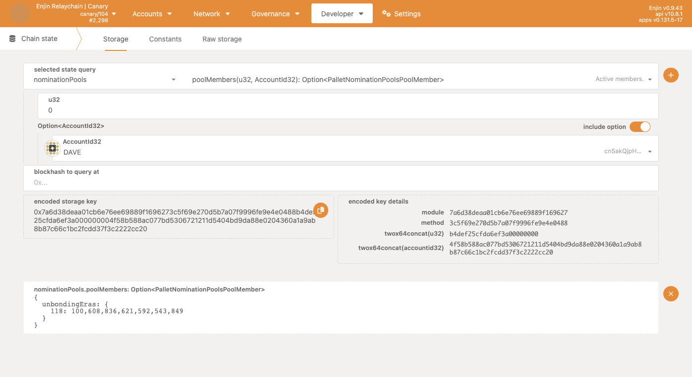
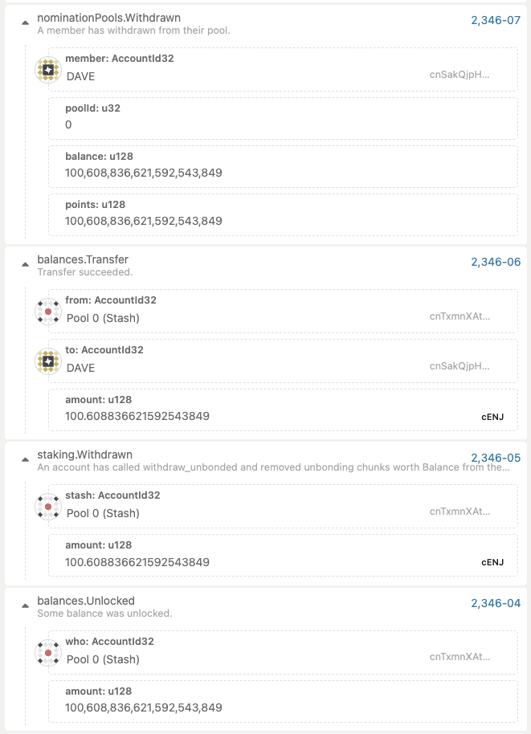

:::info The Enjin Blockchain Console
Use [console.enjin.io](https://console.enjin.io/) to use the user interface referenced in this document.
:::

:::tip
For a more user friendly staking interface, we suggest to use the [Enjin Wallet](https://enjin.io/products/wallet).
:::

Enjin Relaychain operates using Nominated Proof of Stake (NPoS) consensus algorithm. NPoS is a variation of Proof of Stake (PoS) consensus algorithm, where the right to produce blocks is delegated to a set of validators. Validators are selected by nominators, who delegate their stake to validators. Validators are rewarded for producing blocks and are sharing the rewards with their nominators.

## Find a nomination pool that satisfies your needs

You should look out for the following criteria when choosing a nomination pool:

- **Points -** Points display the amount of staked ENJ (sENJ) this pool has in circulation. Its important to remember that each pool issues its own unique `sENJ-poolID` token, so the amount of points does not directly correlate to the amount of ENJ staked in the pool.
- **Capacity -** shows the maximum amount of sENJ that the pool can issue. If the capacity is reached, you will not be able to stake ENJ in the pool.
- **Nominees -** displays the validators that the pool is nominating. Remember that the pool will only receive rewards if their nominated validators are selected to produce a block. If the validator is slashed for any reason (e.g. being offline for too long), the funds nominated by pool will be slashed as well.
- **Members -** shows the current participants for each nomination pool. More members can provide higher stake, but it also means that rewards will be split between more people.
- **Bonus Cycle -** when pool information is expanded, you can see the `start era` and `end era` number of the bonus cycle, during this period the bonus rewards are tracked for the pool and its members.

## Stake ENJ in a nomination pool

The pool with `ID 0` is nominating `Alice_STASH` validator and has 3 pool members (including the pool account). To stake 100 ENJ in this pool, click on the `Join` button.

Let's say Dave wishes to join this pool with 100 ENJ. With current staked ENJ and issued sENJ, he should receive 100 points (sENJ) for his stake.

Now we can also check our `sENJ-poolID` balance to be sure our stake was successful:

This will return Dave's `sENJ-poolID` balance for this specific pool with ID 0, which is also the sENJ token id. And this returns a balance of 100 sENJ units.

### Rewards

Rewards accrue every era (24h) for validators and subsequently to nominators. They can be claimed using n`ominationPools.payoutRewards()` extrinsic, which is easily accessible under each pool when expanded. This can be called by any member of the pool and will distribute rewards to all members of the pool including validators.

### Inflation

Every era the rewards are generated for NPoS participants, creating inflation. The inflation rate is fixed at `5% per year`. So every era, `~0.0134%` of the total ENJ supply on chain is generated and distributed to NPoS participants. Calculation takes compounding effect into consideration. The rewards are distributed proportionally to the amount of stake each participant has in the network.

## Leaving a nomination pool

If you wish to leave a nomination pool, you can do so by clicking on the `Unbond` button that is displayed under each expanded pool. Please note that unbonding period is not immediate and the bonus cycle needs to completely pass before funds can be withdrawn using `Withdraw unbonded` button.

We can see that correct events were emitted, which also indicates that rewards were paid out to all members of the pool and now the same 100 sENJ are worth more than 100 ENJ, and Dave unbonds `100.608836621592543849 ENJ`:

Unbonded funds can only be withdrawn once the correct era is reached. We can observe how much and when each unbonding member can withdraw by looking at the chain state

This informs us that at era 118, we will be able to withdraw our unbonded ENJ from the pool (including reward). We can see current era at `staking.currentEra` storage.

And now that we are past the unbonding era, we can withdraw our funds:

And we can see that the correct amount of ENJ was withdrawn from the pool and transferred to us (Dave):

