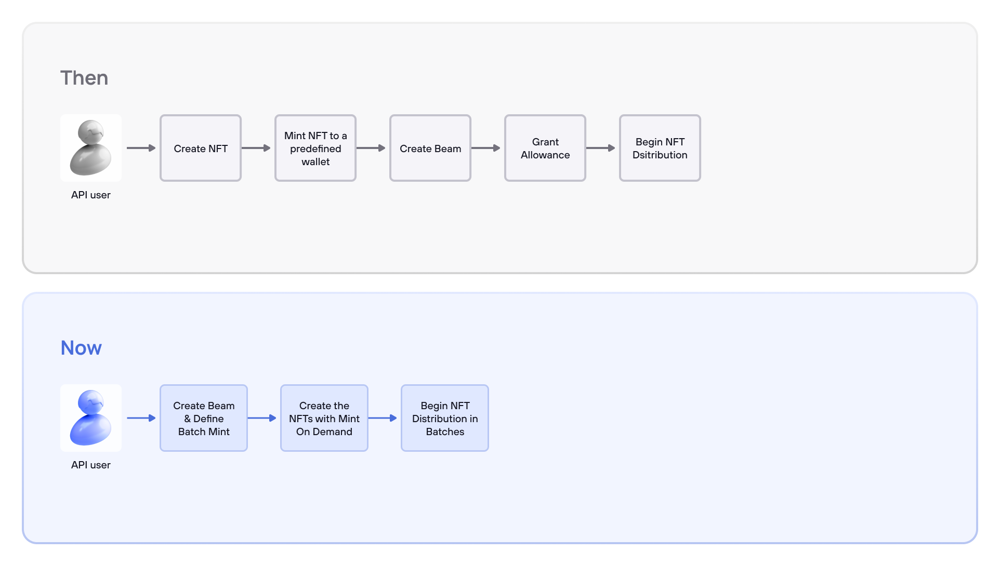

## What is Enjin Beam?

Enjin Beam offers an efficient way to market, promote, and distribute blockchain assets. By leveraging QR code technology, Enjin Beam allows for the easy distribution of blockchain assets on the Enjin blockchain. This feature is available on NFT.io and can be used by anyone who registers on the marketplace.

Moreover, game developers can access Enjin Beam through the Enjin Platform API, which is designed to automate the distribution process. On the other hand, [NFT.io](https://nft.io/) is intended for users who prefer a more hands-on approach.

### Here's how Enjin Beam works:

1. First, blockchain assets are created on NFT.io or through the Enjin Platform API.
2. The assets are then placed in a smart contract, acting as a "vault", using the Beam interface. This generates a unique QR code.
3. Users can scan the code with the [Enjin Wallet](https://enjin.io/products/wallet) app and receive the blockchain asset directly into their wallet.
4. If the user does not have the Enjin Wallet installed, they can still interact with the Enjin Web Wallet interface to claim their blockchain assets using Enjin Beam.

### Send Anything; Post Anywhere

Enjin Beam offers a flexible way to send rewards that can be customized to fit your target audience and marketing goals. Whether it's gaming assets, branded collectibles, or early access, Enjin Beam lets you personalize your rewards to meet your needs.

Beam QR codes can be shared through various visually accessible platforms, including social media networks, websites, ads, videos, flyers, presentations, and even within apps or games. This allows you to reach a broad audience and get your rewards in front of the right people.

**Enjin Beam enables you to:**

1. Simplify the creation and generation of QR codes with a few straightforward steps.
2. Distribute NFTs on a large scale via a QR code, making it easy for users to scan and claim.
3. Enhance your online presence and offer a user-friendly experience that appeals to a wide range of users, including those who are not familiar with crypto or blockchain technology.

## Types of Beams

### Mint on Demand

One of the significant differences between Enjin Beam and its predecessors is the `MINT_ON_DEMAND` feature. This feature eliminates the need to pre-mint all tokens for distribution, which is the default way of creating beams on Enjin Blockchain. With this feature, Beam creators can define a parameter on the mutation for tokens to be minted directly to users' wallets at the exact moment they are claimed, reducing the time people wait for the tokens to arrive in their wallets.

### Batch Mint & Batch Transfer

Enjin Beam also introduces batch mint and batch transfer features, allowing multiple tokens to be minted and/or transferred in a single on-chain transaction. This reduces the overall system load during periods of high activity, and users can claim their tokens faster and at a  significantly lower cost. With the ability to batch 150 mints into a single transaction, users can claim their tokens faster and at a lower cost.

### Integer Range Type

The Integer Range type is another new feature that makes creating Beams more efficient. By using this feature, you can specify a sequential range of token IDs for distribution using a shorthand format. So instead of specifying all of the token IDs you want to distribute individually, we can now simply provide an integer range in this format: "[startId..endId]" e.g. ["1..10000"] you can also mix and match single IDs and ranges: ["1", "5..10", "12", "15", "20..32"]

### Set attributes on the go!

Developers can now set attributes to the minted tokens as they're being minted on-chain for the first time. This feature allows for unique and computed metadata to be added to tokens during the creation process.  
This interaction with the mint on-demand feature is a match made in heaven as game developers will be able to create the tokens. At the same time, the beam is being generated, and they can set the metadata and mint the tokens as the demand for new tokens increases.

